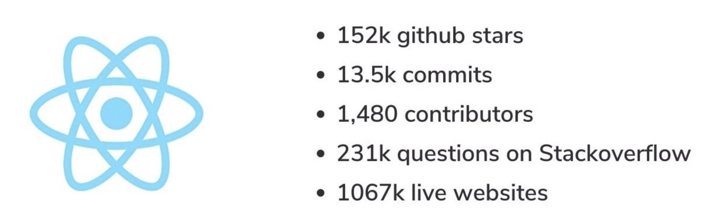
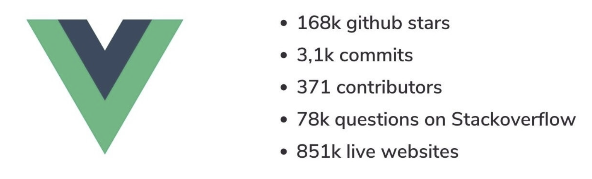

## Exercises: Why React?

### Why did you chose to use react?
*¿Por qué elegiste usar React?*

Because I've heard that is pretty popular and because I'm volunteering in a project to create a web applicarion for #WomenWhoCode.

*Porque he escuchado que es popular y porque estoy apoyando en un proyecto para crear una aplicación web para #WomenWhoCode.*

 

### What measures do you use to know popularity ?
*¿Qué medidas utilizas para conocer la popularidad?* 

I consider:
- How many projects are written using that programming language or library.
- How many times I see the language requested in a job ad.

*Yo considero:*
- La cantidad de proyectos escritos utilizando ese lenguaje de programación o libreria.
- La cantidad de veces que veo ese lenguaje de programación en un aviso de trabajo.
 

### What is more popular, React or Vue ?

According to Github and Stackoverflow: React is more popular.

*Según github y Stackoverflow: React es más popular 🤪*
 

 

[Read +](https://www.mindk.com/blog/react-vs-vue/)